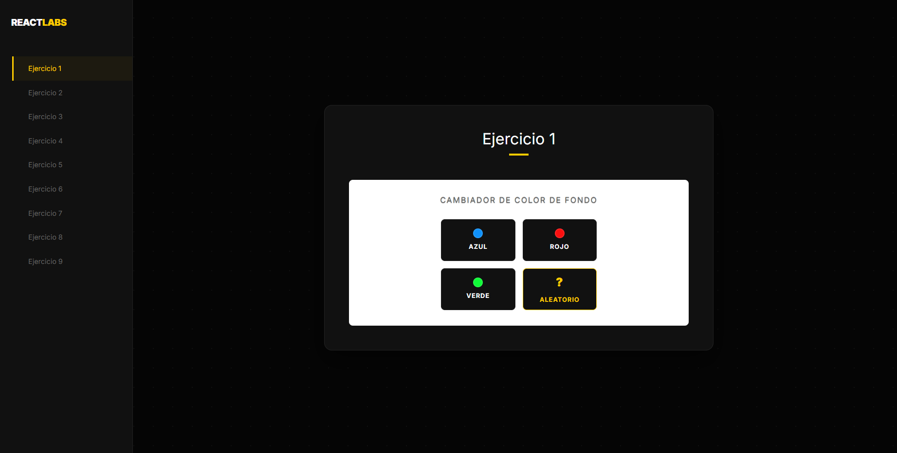
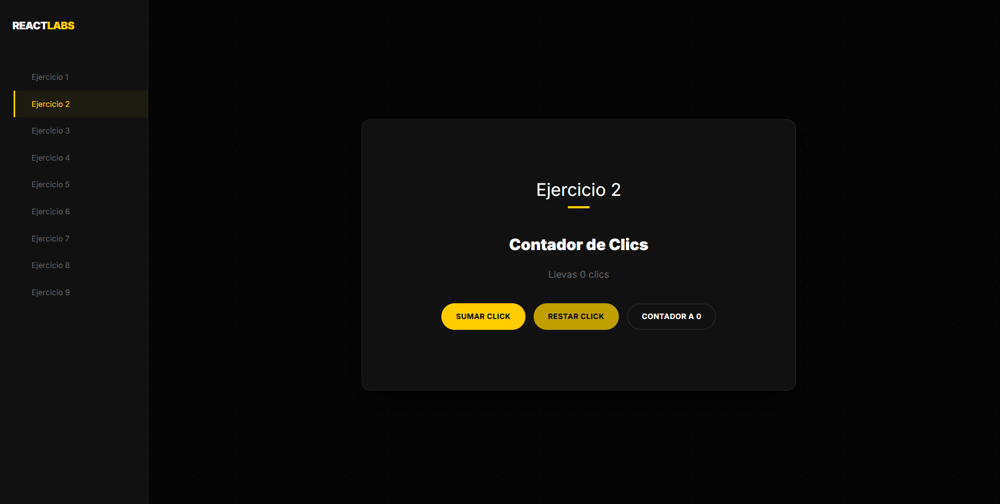
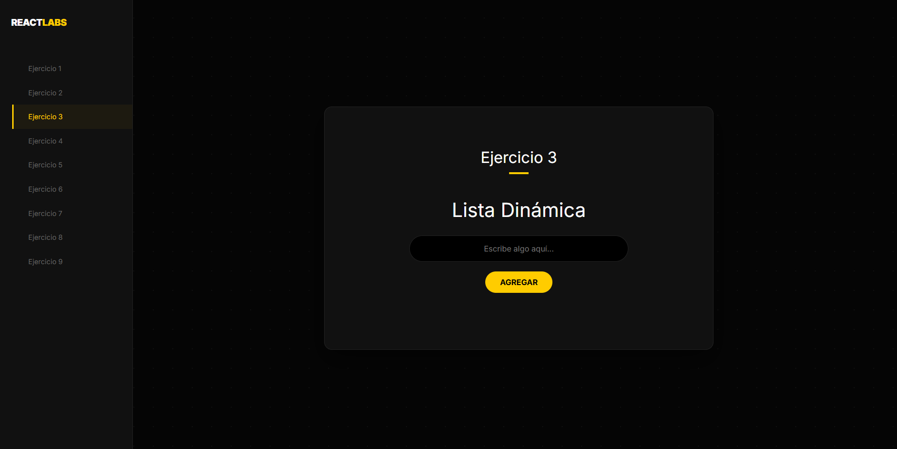
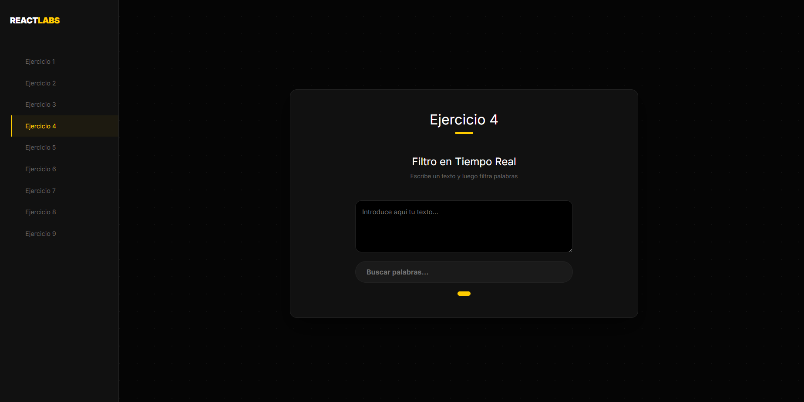
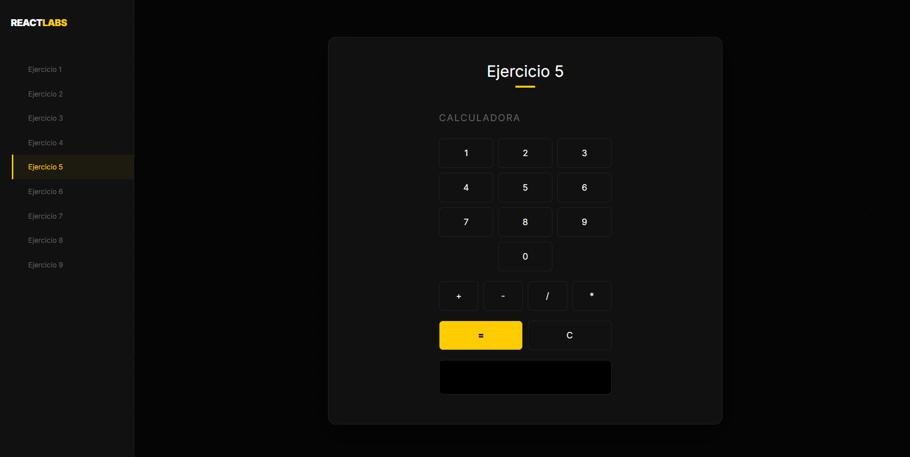
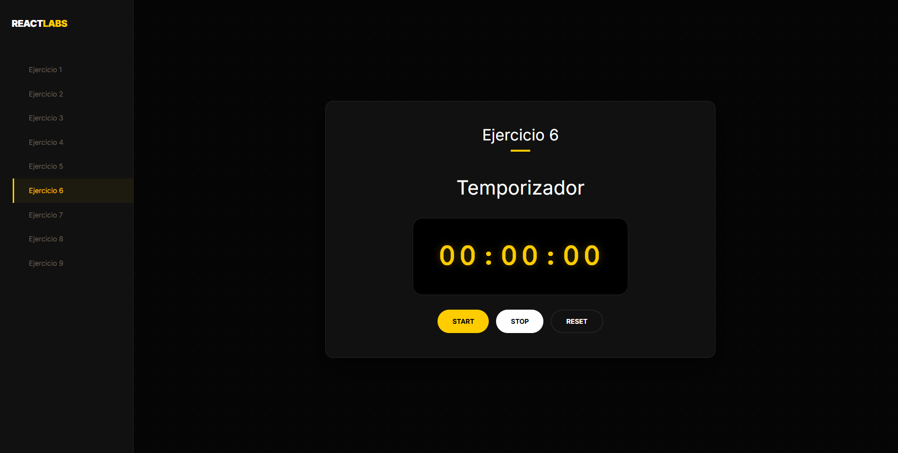
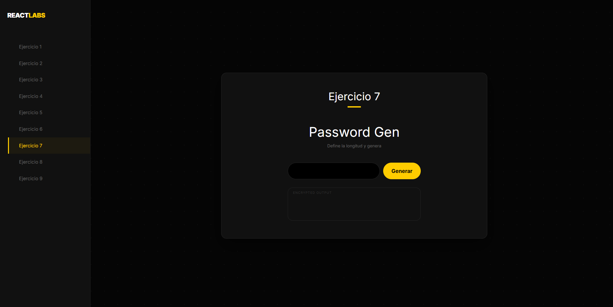
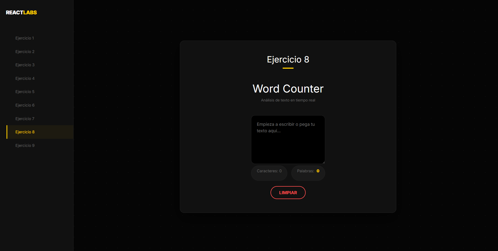
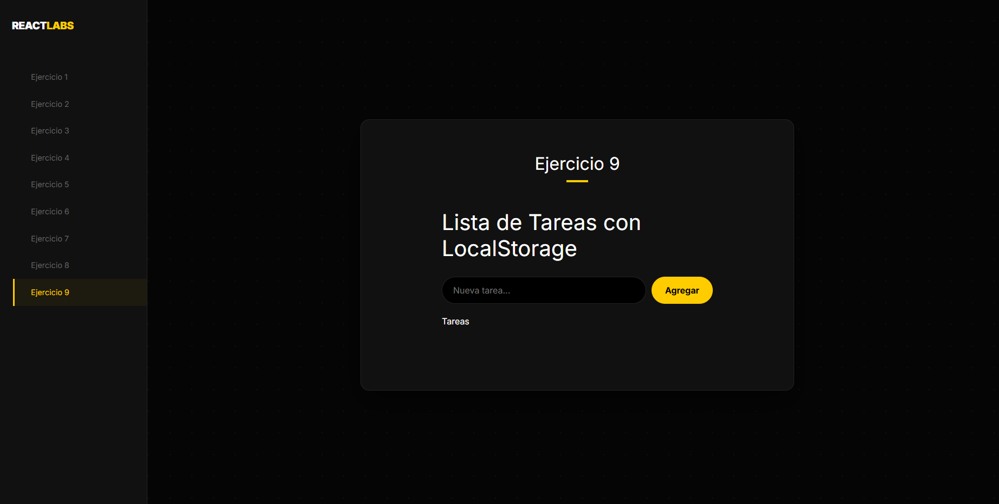

<h1 align="center" style="color: #0366d6;">
   VITE + REACT + TS
</h1>

Repositorio con ejercicios de REACT.

## Descripción 📝

Proyecto realizado con REACT en el que se desarrollan una serie de ejercicios. Calculadora, lista de tareas, cambios de color, etc.

## Vista previa en vivo 👀
Puedes ver los ejercicios funcionando aquí:  
🔗 https://oconcejero.github.io/VITE_REACT_TS/

Puedes ver una vista previa en vivo de la página.

